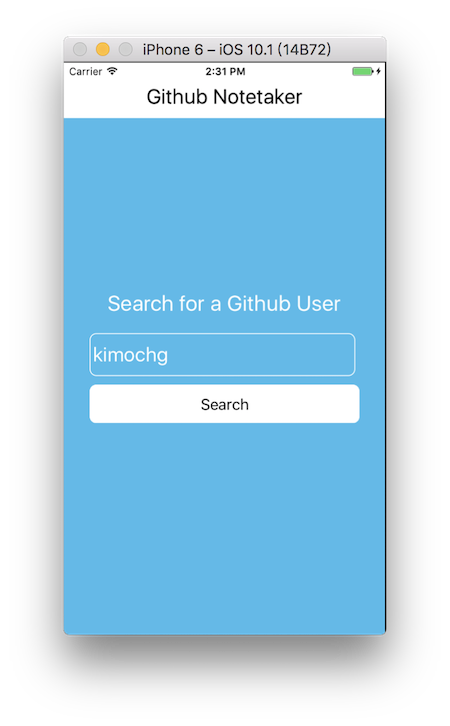
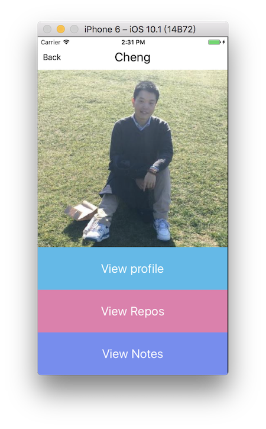
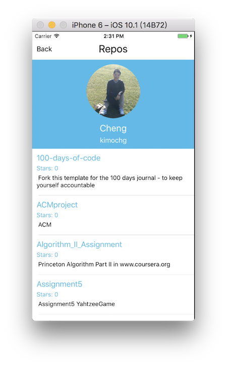
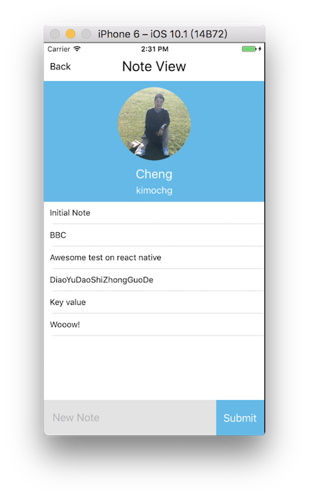

# Github Note Taker

# Dependency
- redux
- react-redux
- redux-logger
- redux-saga

# Backend
- [Firebase](https://firebase.google.com/)

## Configure
from
```
{
  "rules": {
    ".read": "auth != null",
    ".write": "auth != null"
  }
}
```
to
```
{
  "rules": {
    ".read": true,
    ".write": true
  }
}
```

# Usage

```Bash
git clone https://github.com/kimochg/react-native-githubnote-app
cd react-native-githubnote-app
npm install (or yarn install as you like)
react-native run-ios
```

PS. Andriod Environment not tested


# Screenshots







